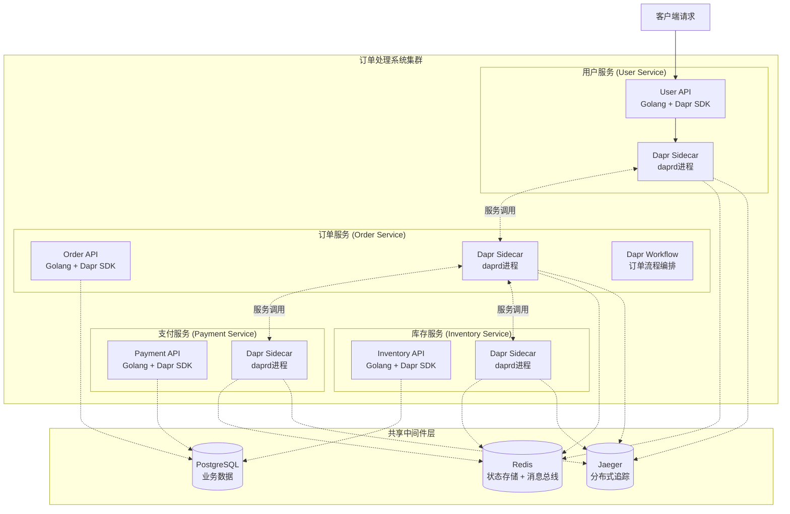

## 第一部分：选题填表

| **类别** | **编号** | **题目** | **限报** | **要求** | **需求概述** | **担任角色** | **建议方案** | **建议语言** | **成果形式** |
|:---:|:---:|:---|:---:|:---:|:---|:---|:---|:---:|:---|
| **2026软件新架构** | 13 | **Dapr多运行时云原生应用实践** | 3 | | 基于CNCF毕业项目Dapr构建云原生微服务应用系统，全面体验Dapr构建块（Building Blocks）的协同使用。开发一个订单处理演示系统，包含用户服务、订单服务、支付服务和库存服务四个微服务，通过Dapr Sidecar实现服务间弹性调用（超时/重试/熔断）、分布式状态管理、发布订阅异步通信和结构化日志追踪。支持水平扩展和优雅启停。重点验证Dapr与Golang SDK的集成实践。 | 架构师，后端 | **核心运行时**：Dapr 1.17+；**构建块**：服务调用、状态管理、发布订阅、工作流；**后端语言**：Golang 1.24+ + Dapr Go SDK；**数据库**：Redis（状态存储+消息总线）+ PostgreSQL（业务数据）；**部署**：Docker Compose + Kubernetes（可选）；**可观测性**：OpenTelemetry + Jaeger + Prometheus。提供多应用一键编排启动和优雅关闭集成。 | Go | 系统、开发报告 |


## 第二部分：完整设计方案与开发思路（2周版）

### 一、选题背景与价值定位

在2026年的云原生与微服务架构中，“能力抽象化”已成为必然趋势。微服务架构正从“容器化部署”迈向“能力抽象化”的新阶段。Golang凭借其轻量协程、静态编译与高并发原生支持，已成为构建服务边界的首选语言。Dapr（Distributed Application Runtime）则以标准化的Sidecar模式，将状态管理、服务调用、发布订阅、分布式追踪等横切关注点下沉为可插拔的运行时能力。

开发者越来越多地将Dapr用于工作流、AI代理和MCP连接的系统——一位Dapr维护者甚至将AI代理描述为“微服务加上大模型”。这印证了2026年的技术方向：Dapr不仅是微服务基础设施，更是AI应用的核心运行时。

2026年初，Dapr v1.17发布，引入了**工作流版本管理**、**批量发布订阅API**、**端到端追踪**，工作流吞吐量提升了41%。与此同时，Dapr与WebAssembly的集成为开发者提供了在Sidecar中运行安全、便携业务逻辑的新可能。同年3月，Dapr Agents v1.0 GA，为构建生产级、弹性AI代理提供了耐用的工作流引擎和状态管理能力。

本项目的核心价值在于：让学生在2周内基于Dapr构建一个完整的云原生微服务应用系统，深入理解Sidecar架构与多运行时理念，掌握Dapr Go SDK的使用方法和多种构建块的协同工作，体验2026年云原生架构的最新实践。


### 二、系统架构设计



**架构说明**：

- 每个微服务以独立进程运行，Dapr Sidecar（`daprd`）以Sidecar模式与主应用共存，通过localhost HTTP/gRPC通信。
- 应用不直接访问中间件，而是通过Sidecar调用Dapr构建块API，实现关注点分离。
- 各服务通过Dapr服务调用构建块相互发现和调用，无需硬编码服务地址。
- 状态管理构建块统一管理订单和库存等分布式状态。


### 三、核心功能模块设计（2周可完成）

#### 模块1：服务间调用（Service Invocation）构建块

服务调用使微服务能够以弹性方式相互通信，支持自动重试、超时和断路器策略。应用通过Dapr Sidecar调用其他服务的API，无需关注服务发现和网络细节。

**订单服务调用库存服务示例**：

```go
// Order Service中的库存查询调用
client, _ := dapr.NewClient()
defer client.Close()

ctx := context.Background()
inventoryReq := &InventoryRequest{ProductId: req.ProductId}
content, _ := json.Marshal(inventoryReq)

resp, err := client.InvokeMethod(ctx, "inventory-service", "check", http.MethodPost, content)
// "inventory-service"是目标服务的App ID，Dapr自动完成服务发现
```

**弹性策略**：在组件配置中为服务调用声明重试策略（最多3次，指数退避）、超时（5秒）和熔断（失败率50%触发）。

#### 模块2：状态管理（State Management）构建块

使用Redis作为状态存储组件，实现订单和购物车等分布式状态的持久化。Dapr的状态管理API封装了底层状态存储的实现细节，应用通过标准HTTP/gRPC接口操作状态。

```go
// Order Service中的状态保存示例
client.SaveState(ctx, "statestore", "order-1001", []byte(`{"id":"1001","status":"created"}`))
```

**并发控制**：支持ETag实现乐观并发控制，通过`concurrency=first-write`策略防止状态冲突。

#### 模块3：发布订阅（Publish & Subscribe）构建块

发布订阅使微服务能够通过异步消息进行事件驱动通信。Dapr提供至少一次（at-least-once）的消息传递保证和消息TTL等高级功能。

**事件流设计**：
- 订单创建时发布`order.created`事件，支付服务和库存服务异步订阅并处理
- 支付完成时发布`payment.completed`事件，订单服务监听更新订单状态
- 库存更新时发布`inventory.updated`事件，监控系统进行库存预警

**订阅配置**（YAML组件声明）：

```yaml
apiVersion: dapr.io/v1alpha1
kind: Component
metadata:
  name: pubsub
spec:
  type: pubsub.redis
  version: v1
  metadata:
  - name: redisHost
    value: localhost:6379
```

#### 模块4：工作流（Workflow）构建块

使用Dapr工作流构建块编排订单处理的完整业务流程，包括库存验证、支付处理和订单状态更新。Dapr工作流是**有状态**的，通过事件溯源（Event Sourcing）维护工作流状态，支持长时间运行和故障容错应用。

工作流包含以下活动：
1. **验证库存活动**：调用库存服务确认所需库存充足
2. **处理支付活动**：调用支付服务扣款
3. **更新库存活动**：调用库存服务扣减库存
4. **发送通知活动**：发送订单状态通知

**工作流引擎**：Dapr Sidecar充作工作流引擎，应用SDK作为工作流Worker。Sidecar管理工作流状态转换、历史持久化，并确保可靠的执行语义。

#### 模块5：Sidecar生命周期对齐与优雅关闭

在多应用场景中使用`dapr run -f`（Multi-App Run）实现一键启动，用`dapr stop -f`一键停止。优雅关闭时，每个Golang应用通过监听系统信号并主动调用Shutdown API，确保所有状态持久化和未提交消息刷盘后再退出：

```go
// 优雅关闭钩子
signal.Notify(sigChan, syscall.SIGTERM, syscall.SIGINT)
go func() {
    <-sigChan
    http.Post("http://localhost:3500/v1.0/shutdown", "application/json", nil)
    os.Exit(0)
}()
```

#### 模块6：Wasm中间件（可选扩展）

Dapr支持将Wasm模块配置为HTTP中间件，在Sidecar管道中运行便携业务逻辑。可将订单处理中的自定义数据验证规则编译为Wasm模块，直接嵌入Sidecar的HTTP管道中执行，无需部署额外服务。

#### 模块7：可观测性集成

- **分布式追踪**：集成OpenTelemetry和Jaeger，自动为每个跨服务调用生成追踪信息。Dapr在Sidecar层面自动生成span（无需修改应用代码），集中展示完整调用链路。
- **指标收集**：通过Prometheus端点导出服务调用延迟、错误率和请求吞吐量等核心指标。


### 四、开发路线图（2周/10个工作日）

| 阶段 | 天数 | 任务 | 输出物 |
|:---|:---|:---|:---|
| **第1-2天** | 2 | 环境准备：Docker+Dapr CLI初始化；学习Dapr Sidecar架构和核心构建块概念；搭建Golang服务基础骨架 | Dapr本地环境就绪，可运行hello world示例 |
| **第3-4天** | 2 | 实现用户服务和订单服务的服务调用；集成Redis状态存储管理订单状态；完成两个服务之间的通信验证 | 服务调用链路打通，订单状态可存储 |
| **第5-6天** | 2 | 实现支付服务和库存服务；完成订单创建→库存验证→支付处理的业务流程；实现发布订阅异步通信（订单事件发布和消费） | 四个微服务协同工作，异步事件驱动 |
| **第7-8天** | 2 | 实现Dapr工作流订单编排引擎；OpenTelemetry + Jaeger集成；Prometheus指标导出 | 完整订单流程自动编排，全链路追踪可视化 |
| **第9-10天** | 2 | 水平扩展测试（多实例）；优雅启停验证；编写Docker Compose编排；项目文档撰写 | 完整交付+部署演示 |


### 五、技术挑战与解决策略

| 挑战 | 解决策略 |
|:---|:---|
| Dapr运行时的本地开发环境配置 | 使用`dapr init`一键初始化默认运行时，自动部署Redis容器；用`dapr run`一键启动Sidecar |
| 多应用同时启动的管理复杂度 | 使用Multi-App Run功能，通过一个`dapr.yaml`文件声明多个应用，用`dapr run -f .`一键启动全部Sidecar |
| 状态存储组件切换 | 组件配置仅需修改YAML中Redis的地址，Golang业务代码通过Dapr SDK调用抽象API，零改动即可切换存储后端 |
| 工作流版本升级的影响 | 利用v1.17版本提供的工作流版本管理，安全演进长时间运行的工作流代码而不破坏在途实例 |
| 分布式追踪链路完整性 | Dapr在Sidecar层面自动注入和传播追踪上下文，应用只需确保完整传递HTTP/gRPC请求上下文 |


### 六、验证与压测方案

**功能验证**：
1. **订单创建流程**：通过用户服务发起订单请求，验证订单服务调用库存服务检查库存，调用支付服务扣款，最终更新订单状态
2. **发布订阅验证**：停止支付服务，创建订单后启动支付服务，验证订单创建事件触发支付处理（至少一次消息投递）
3. **工作流恢复验证**：订单工作流执行到一半时手动停止订单服务，重启后验证工作流从检查点恢复继续执行
4. **优雅关闭验证**：发送SIGTERM信号，验证各服务先完成pending操作再退出，无数据丢失

**性能测试**：
- **并发订单创建**：模拟100并发同时创建订单，验证库存并发扣减的一致性（Dapr状态管理+乐观锁）
- **服务调用延迟**：测量跨服务的端到端调用延迟（目标p99 < 100ms）
- **水平扩展测试**：将订单服务副本数从1扩展到3，负载均衡自动生效


### 七、拓展方向（两周后可选的完善）

- **Dapr Agents集成**：利用Dapr Agents Python框架（2026年3月GA）为订单系统添加AI代理能力，实现智能补货预测、异常订单自动审批等高级功能。Dapr Agents提供了耐用工作流引擎、状态管理、自动重试和中断恢复等能力，帮助代理从故障中恢复。
- **Wasm扩展开发**：用TinyGo将自定义业务逻辑（如数据验证规则、请求转换过滤器）编译为Wasm模块，注册为Dapr HTTP中间件组件，在Sidecar管道中直接运行。
- **Kubernetes生产部署**：将系统部署到K8s集群，利用Dapr的Kubernetes模式，体验声明式配置、自动Sidecar注入和Operator管理。
- **多语言异构**：将一个服务替换为Python或.NET版本，验证Dapr的语言无关性。
- **加密API保护敏感配置**：使用Dapr秘密管理API安全存储数据库密码和API密钥。


### 八、成果形式

- 源代码仓库（GitHub），包含四个微服务的完整代码、Dapr组件YAML配置、`dapr.yaml`多应用编排文件
- 项目设计报告（需求分析、架构设计、各构建块详细说明、验证测试结果）
- 演示视频（5分钟，展示系统启动、订单创建流程、分布式追踪界面、优雅关闭过程）